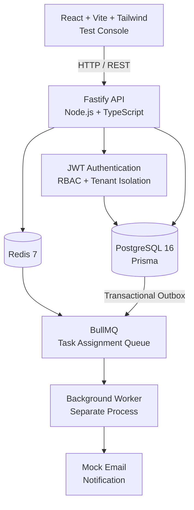
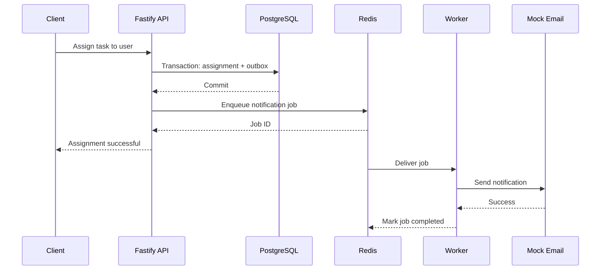

# TaskFlow

> A production-oriented, multi-tenant project management backend built for the **GrubPac Technologies Backend Developer Assignment**.

TaskFlow provides organization-scoped project and task management with secure authentication, RBAC, PostgreSQL persistence, Redis/BullMQ asynchronous processing, and a separate background worker.

---

## 🎥 Working Demo

## 🎥 Working Demo

[](https://youtu.be/unS2rHzq0lY?autoplay=1)


**▶ [Watch the TaskFlow working demo](https://youtu.be/unS2rHzq0lY)**

The demo shows the working application, authentication, organization/project/task workflows, API functionality, and background worker processing.

---

## Architecture



### Request Flow

```text
Browser
   │
   │ HTTP / REST
   ▼
Fastify API
   │
   ├──────────────► PostgreSQL
   │                    │
   │                    └── Prisma
   │
   └──────────────► Redis
                         │
                         ▼
                    BullMQ Queue
                         │
                         ▼
                    Worker Process
                         │
                         ▼
                   Mock Email
```

### Task Assignment Notification Flow



---

## Why This Architecture?

### Separate API and Worker Processes

The API handles synchronous HTTP requests while the worker handles asynchronous notification processing.

Background notification processing therefore does not block the API request lifecycle.

### PostgreSQL as the Source of Truth

PostgreSQL stores:

* Users
* Organizations
* Organization memberships
* Projects
* Tasks
* Assignments
* Comments
* Refresh tokens
* Notification outbox records

Prisma provides the database access layer.

### Redis + BullMQ

Task assignment notifications are processed asynchronously using Redis and BullMQ.

The queue is consumed by a dedicated worker process rather than running background processing inside the API process.

### Transactional Outbox

Task assignment and creation of the notification outbox record happen atomically inside PostgreSQL.

The system then attempts to enqueue the notification through BullMQ. If immediate queue submission fails, the worker-side recovery process can recover pending notifications.

### Server-Side Multi-Tenant Isolation

The organization ID supplied by the client is treated as a selector, not an authorization decision.

The authenticated user's organization membership and role are re-verified against PostgreSQL before accessing organization-owned resources.

---

# Tech Stack

| Layer             | Technology                  |
| ----------------- | --------------------------- |
| Runtime           | Node.js 20                  |
| Language          | TypeScript                  |
| API Framework     | Fastify                     |
| Database          | PostgreSQL 16               |
| ORM               | Prisma                      |
| Queue             | BullMQ                      |
| Queue Backend     | Redis 7                     |
| Authentication    | JWT                         |
| Password Hashing  | bcrypt                      |
| Validation        | Zod                         |
| API Documentation | Swagger / OpenAPI           |
| Testing           | Vitest                      |
| Containerization  | Docker + Docker Compose     |
| Frontend Console  | React + Vite + Tailwind CSS |

---

# Key Features

* User registration and login
* Access and refresh JWT authentication
* Refresh-token rotation and reuse detection
* Logout for single device or all sessions
* Multi-tenant organization model
* Organization-scoped RBAC
* `org_admin` and `member` roles
* Project CRUD
* Task CRUD
* Task assignment and unassignment
* Task filtering
* Full-text task search
* Offset pagination
* Task comments
* Bulk task status updates
* Project dashboard
* Soft deletion
* Redis + BullMQ asynchronous notifications
* Notification retry and exponential backoff
* Dead-letter queue
* Job status endpoint
* Transactional notification outbox
* Swagger UI
* Postman collection
* Unit tests
* Integration tests
* Dockerized API and worker
* PostgreSQL and Redis health checks

---

# Project Structure

```text
taskflow/
│
├── backend/
│   ├── src/
│   │   ├── modules/
│   │   │   ├── auth/
│   │   │   ├── organizations/
│   │   │   ├── members/
│   │   │   ├── projects/
│   │   │   ├── tasks/
│   │   │   └── jobs/
│   │   │
│   │   ├── middleware/
│   │   ├── infrastructure/
│   │   ├── shared/
│   │   ├── docs/
│   │   ├── config.ts
│   │   └── server.ts
│   │
│   ├── worker/
│   │   └── worker.ts
│   │
│   ├── prisma/
│   │   ├── schema.prisma
│   │   ├── migrations/
│   │   └── seed.ts
│   │
│   ├── tests/
│   │   ├── unit/
│   │   └── integration/
│   │
│   ├── docs/
│   │   ├── architecture.md
│   │   ├── database.md
│   │   ├── technical-decisions.md
│   │   └── requirement-checklist.md
│   │
│   ├── postman/
│   │   └── TaskFlow.postman_collection.json
│   │
│   ├── Dockerfile
│   └── docker-compose.yml
│
└── frontend/
    ├── src/
    └── README.md
```

---

# Backend Layering

Every API request follows:

```text
Route
  ↓
Controller
  ↓
Service
  ↓
Repository
  ↓
Prisma
  ↓
PostgreSQL
```

Responsibilities are intentionally separated:

* **Routes** — HTTP route definitions
* **Controllers** — request parsing and response mapping
* **Services** — business rules
* **Repositories** — database access
* **Prisma** — database abstraction
* **Middleware** — authentication, tenancy, RBAC, validation and cross-cutting concerns

Repositories are the only application layer that directly accesses Prisma.

---

# Database Design

The database contains the required project-management entities along with session and notification infrastructure.

Core entities include:

* Users
* Organizations
* Organization memberships
* Projects
* Tasks
* Task assignments
* Task comments
* Refresh tokens
* Notification outbox

Database design details, relationships, indexes, deletion behavior, and constraints are documented in:

```text
docs/database.md
```

Migrations are maintained as SQL under:

```text
prisma/migrations/
```

---

# Authentication

Authentication endpoints:

```text
POST /auth/register
POST /auth/login
POST /auth/refresh
POST /auth/logout
```

Security characteristics:

* bcrypt password hashing with cost 12
* Short-lived access tokens
* Refresh tokens
* Refresh-token rotation
* Refresh-token reuse detection
* Refresh tokens stored as SHA-256 hashes
* Session revocation support

The access JWT intentionally carries only:

```json
{
  "sub": "<user-id>",
  "type": "<token-type>"
}
```

Organization and role information is not trusted from the JWT.

---

# Multi-Tenancy

Every organization-owned resource is scoped to the authenticated user's organization.

The client sends:

```http
X-Organization-Id: <organization-id>
```

The header is treated only as a selector.

The server then:

1. Verifies the JWT.
2. Reads the requested organization ID.
3. Checks the user's membership in that organization.
4. Derives the user's role from the database.
5. Stores the verified organization context on the request.
6. Scopes organization-owned queries server-side.

This prevents a client from simply changing an organization ID and accessing another tenant's data.

---

# RBAC

TaskFlow currently defines two organization roles:

```text
org_admin
member
```

Administrators can perform privileged organization operations such as member management and project deletion.

RBAC is enforced centrally through:

```text
middleware/role.middleware.ts
```

Routes use:

```text
requireRole(...)
```

rather than duplicating authorization logic inside individual controllers.

---

# Background Job Architecture

Task assignment notifications use a dedicated BullMQ queue:

```text
task-assignment-notifications
```

The worker runs separately from the API:

```text
API Process
    │
    └── enqueue job
             │
             ▼
          Redis
             │
             ▼
       BullMQ Queue
             │
             ▼
       Worker Process
             │
             ▼
        Mock Email
```

The API does not execute notification processing inside the HTTP request handler.

---

# Queue Consistency Strategy

Task assignment is the most consistency-sensitive asynchronous workflow.

The implementation:

1. Persists the task assignment.
2. Creates a notification outbox record.
3. Commits both atomically in PostgreSQL.
4. Attempts to enqueue the BullMQ job.
5. Recovers pending outbox records if immediate enqueue fails.

This avoids losing the notification solely because Redis/BullMQ was temporarily unavailable after the database transaction committed.

The detailed tradeoffs are documented in:

```text
docs/technical-decisions.md
```

---

# Retry and Dead-Letter Queue

Notification jobs use:

```text
Initial attempt
      ↓
Retry 1
      ↓
Retry 2
      ↓
Retry 3
      ↓
Dead-Letter Queue
```

There are **4 total attempts**:

```text
1 initial + 3 retries
```

Backoff:

```text
1s → 2s → 4s
```

After retry exhaustion, the job is moved to:

```text
task-assignment-notifications-dlq
```

Job status can be inspected through:

```http
GET /jobs/:id
```

---

# API Documentation

Swagger/OpenAPI is available at:

```text
http://localhost:3000/docs
```

When running through GitHub Codespaces, use the forwarded port-3000 URL:

```text
https://<codespace>-3000.app.github.dev/docs
```

A Postman collection is included:

```text
postman/TaskFlow.postman_collection.json
```

The collection uses variables such as:

```text
baseUrl
accessToken
organizationId
projectId
taskId
jobId
```

The intended demo flow is:

```text
Register
   ↓
Login
   ↓
Create Project
   ↓
Create Task
   ↓
Assign Task
   ↓
Check Job Status
   ↓
View Task
   ↓
View Dashboard
```

---

# Running with GitHub Codespaces

You do not need Docker, PostgreSQL, or Redis installed on your laptop.

Docker runs inside the GitHub Codespace.

### Start backend services

From:

```text
backend/
```

run:

```bash
docker compose up --build
```

This starts:

```text
API
Worker
PostgreSQL
Redis
```

### Apply migrations and seed data

In another terminal:

```bash
npm run db:setup
```

### Start frontend

```bash
cd frontend
npm install
npm run dev
```

The frontend runs on port:

```text
5173
```

The API runs on:

```text
3000
```

Swagger runs on:

```text
3000/docs
```

For Codespaces, forward ports `5173` and `3000` through the Codespaces Ports panel.

PostgreSQL and Redis should remain private.

See:

```text
docs/codespaces.md
```

for the full Codespaces setup and port-forwarding instructions.

---

# Local Setup

## Prerequisites

* Node.js 20+
* Docker and Docker Compose

or:

* PostgreSQL 16
* Redis 7

### Docker Compose

```bash
cp .env.example .env
docker compose up --build
```

Then apply migrations and seed data:

```bash
npm install
npm run db:setup
```

API:

```text
http://localhost:3000
```

Swagger:

```text
http://localhost:3000/docs
```

---

# Running Without Docker

```bash
npm install
cp .env.example .env
npm run db:setup
```

Start the API:

```bash
npm run dev
```

Start the worker in another terminal:

```bash
npm run dev:worker
```

---

# Frontend

```bash
cd frontend
npm install
cp .env.example .env
npm run dev
```

The frontend uses:

```env
VITE_API_URL=<API URL>
```

When running locally:

```text
http://localhost:3000
```

When running in Codespaces, configure it with the forwarded API URL.

---

# Environment Variables

See:

```text
.env.example
```

for the complete list.

Configuration is validated during application startup by:

```text
src/config.ts
```

The application fails fast when required configuration is missing or invalid.

Important configuration categories include:

```text
Application
Database
Redis
JWT
Security
Rate limiting
Email
```

Secrets and real `.env` files are intentionally excluded from version control.

---

# Database Migrations

Apply existing migrations:

```bash
npx prisma migrate deploy
```

For Docker-based execution:

```bash
docker compose run --rm api npx prisma migrate deploy
```

Check migration status against the Docker database:

```bash
docker compose run --rm api npx prisma migrate status
```

For local development where schema changes need new migrations:

```bash
npx prisma migrate dev
```

---

# Seed Data

Run:

```bash
npm run prisma:seed
```

or:

```bash
npm run db:setup
```

The seed creates:

* 2 organizations
* 5 users
* 3 projects
* 15 tasks
* Assignments
* Comments

---

# Demo Credentials

All demo accounts use:

```text
DemoPass123!
```

Development-only credentials.

| Organization        | Role      | Email                                                 |
| ------------------- | --------- | ----------------------------------------------------- |
| Nimbus Logistics    | org_admin | [admin@nimbus.example](mailto:admin@nimbus.example)   |
| Nimbus Logistics    | member    | [member@nimbus.example](mailto:member@nimbus.example) |
| Nimbus Logistics    | member    | [dev@nimbus.example](mailto:dev@nimbus.example)       |
| Solace Retail Group | org_admin | [admin@solace.example](mailto:admin@solace.example)   |
| Solace Retail Group | member    | [member@solace.example](mailto:member@solace.example) |

### Multi-Tenant Isolation Demo

Use two different organization admins to demonstrate tenant isolation.

For example:

1. Login as:

```text
admin@nimbus.example
```

2. Obtain the Nimbus organization ID.

3. Attempt to access a Solace resource using the Nimbus organization context.

Expected behavior:

```text
403 Forbidden
```

The application must not expose another organization's data.

---

# API Examples

## Register

```bash
curl -X POST http://localhost:3000/auth/register \
  -H "Content-Type: application/json" \
  -d '{
    "email":"you@example.com",
    "password":"StrongPass123!",
    "fullName":"You",
    "organizationName":"Your Org"
  }'
```

---

## Create Project

```bash
curl -X POST http://localhost:3000/api/v1/projects \
  -H "Authorization: Bearer <accessToken>" \
  -H "X-Organization-Id: <organizationId>" \
  -H "Content-Type: application/json" \
  -d '{
    "name":"Website Relaunch"
  }'
```

---

## Filter Tasks

```bash
curl "http://localhost:3000/api/v1/projects/<projectId>/tasks?status=in_progress&priority=high&dueFrom=2026-08-01&dueTo=2026-08-31" \
  -H "Authorization: Bearer <accessToken>" \
  -H "X-Organization-Id: <organizationId>"
```

---

## Assign a Task

```bash
curl -X POST http://localhost:3000/api/v1/tasks/<taskId>/assignments \
  -H "Authorization: Bearer <accessToken>" \
  -H "X-Organization-Id: <organizationId>" \
  -H "Content-Type: application/json" \
  -d '{
    "userId":"<targetUserId>"
  }'
```

---

# Health Check

The API exposes:

```text
GET /health
```

The health endpoint checks both PostgreSQL and Redis.

Expected response:

```json
{
  "status": "ok",
  "checks": {
    "database": "ok",
    "redis": "ok"
  }
}
```

---

# Docker

The backend uses a multi-stage Docker build.

The same Dockerfile produces separate:

```text
api
worker
```

targets.

Docker Compose runs:

```text
┌─────────────────────────────┐
│        Docker Compose       │
├─────────────────────────────┤
│                             │
│  ┌─────────┐   ┌─────────┐  │
│  │   API   │   │ Worker  │  │
│  │  :3000  │   │         │  │
│  └────┬────┘   └────▲────┘  │
│       │             │       │
│       ▼             │       │
│  ┌─────────┐   ┌────┴────┐  │
│  │Postgres │   │  Redis  │  │
│  │  :5432  │   │  :6379  │  │
│  └─────────┘   └─────────┘  │
│                             │
└─────────────────────────────┘
```

Start:

```bash
docker compose up --build
```

Stop:

```bash
docker compose down
```

To remove containers **and the PostgreSQL volume**:

```bash
docker compose down -v
```

---

# Testing

### Unit Tests

```bash
npm test
```

Unit tests do not require PostgreSQL or Redis.

### Integration Tests

```bash
npm run test:integration
```

Integration tests require a running PostgreSQL and Redis instance.

Use a dedicated test database.

Do not run integration tests against the development database.

### Coverage

```bash
npm run test:coverage
```

---

# Technical Decisions

Detailed engineering decisions are documented in:

```text
docs/technical-decisions.md
```

The document covers:

* Pagination strategy
* Refresh-token storage
* Token rotation
* CASCADE / RESTRICT behavior
* Multi-tenant isolation
* Assignment/queue consistency
* Retry semantics
* Dead-letter queue
* Test isolation
* Outbox recovery

The goal is to document not only **what** was implemented, but **why** each non-obvious decision was made and what tradeoffs were accepted.

---

# Requirement Mapping

| Requirement         | Implementation                 |
| ------------------- | ------------------------------ |
| Node.js backend     | Node.js 20 + TypeScript        |
| REST API            | Fastify                        |
| PostgreSQL          | PostgreSQL 16                  |
| ORM                 | Prisma                         |
| Authentication      | JWT                            |
| Password security   | bcrypt                         |
| Multi-tenancy       | Organization-scoped middleware |
| RBAC                | `org_admin` / `member`         |
| CRUD                | Projects and tasks             |
| Task assignment     | Assignment service             |
| Async processing    | Redis + BullMQ                 |
| Background worker   | Separate worker process        |
| Notifications       | Mock email                     |
| Retry               | Exponential backoff            |
| DLQ                 | Dedicated BullMQ DLQ           |
| Job status          | `GET /jobs/:id`                |
| API documentation   | Swagger + Postman              |
| Containerization    | Docker + Docker Compose        |
| Database migrations | Prisma migrations              |
| Testing             | Vitest                         |
| Frontend demo       | React + Vite + Tailwind        |
| Cloud development   | GitHub Codespaces              |

---

# Assumptions

The following implementation decisions were made where the assignment specification was ambiguous:

1. Assignment-mandated endpoint paths such as `/auth/*` and `/jobs/:id` are preserved exactly.

2. Business resources use the `/api/v1` prefix as a conventional REST API structure.

3. Registration can create a new organization, making the caller an `org_admin`, or join an existing organization by ID as a `member`.

4. Adding members after organization creation is an administrator-only operation.

5. "3 retries" is interpreted as 3 retries after the initial attempt, resulting in 4 total attempts.

6. Offset pagination is used because the assignment allows either offset or cursor pagination.

---

# Known Limitations

### Outbox Recovery Delay

If the immediate BullMQ enqueue attempt fails, notification delivery can be delayed by the recovery sweep interval rather than being instantaneous.

This is a deliberate consistency tradeoff.

### Soft Delete Behavior

Soft-deleting a project does not physically delete its tasks.

Tasks belonging to soft-deleted projects are excluded from API visibility.

### Refresh Token Family UI

Server-side defensive revocation exists for refresh-token reuse detection, but there is no dedicated user-facing endpoint that reports that all sessions were revoked because of suspicious refresh-token reuse.

### Outbox Monitoring

The `/health` endpoint checks PostgreSQL and Redis connectivity but does not independently monitor the age of the oldest pending outbox record.

A production deployment would benefit from a dedicated outbox backlog/age metric.

---

# API Endpoint Overview

## Authentication

```text
POST   /auth/register
POST   /auth/login
POST   /auth/refresh
POST   /auth/logout
```

## Organizations

```text
GET    /api/v1/organizations
POST   /api/v1/organizations
...
```

## Members

```text
GET    /api/v1/members
POST   /api/v1/members
...
```

## Projects

```text
GET    /api/v1/projects
POST   /api/v1/projects
GET    /api/v1/projects/:id
PATCH  /api/v1/projects/:id
DELETE /api/v1/projects/:id
```

## Tasks

```text
GET    /api/v1/tasks
POST   /api/v1/tasks
GET    /api/v1/tasks/:id
PATCH  /api/v1/tasks/:id
DELETE /api/v1/tasks/:id
```

## Task Assignments

```text
POST   /api/v1/tasks/:taskId/assignments
DELETE /api/v1/tasks/:taskId/assignments/:userId
```

## Jobs

```text
GET    /jobs/:id
```

## Health

```text
GET    /health
```

For the complete API contract, use the Swagger documentation.

---

# Engineering Principles

The implementation follows several principles throughout the backend:

* Keep controllers thin.
* Keep business rules inside services.
* Keep database access inside repositories.
* Treat PostgreSQL as the source of truth.
* Never trust tenant or role information supplied by the client.
* Keep asynchronous work outside the HTTP request lifecycle.
* Make queue processing retryable.
* Provide a dead-letter path for permanently failed jobs.
* Validate configuration at startup.
* Keep authentication and authorization separate.
* Document assumptions and known limitations explicitly.
* Prefer explicit failure handling over silent failure.

---

# Submission

### GitHub Repository

```text
https://github.com/mdShakil2004/taskflow
```

### Demo

```text
https://youtu.be/unS2rHzq0lY
```

### Documentation

```text
docs/architecture.md
docs/database.md
docs/technical-decisions.md
docs/requirement-checklist.md
```

### API Documentation

```text
Swagger: /docs
Postman: postman/TaskFlow.postman_collection.json
```

---

## Built for the GrubPac Technologies Backend Developer Assignment

TaskFlow is implemented as a complete backend-focused system with a working React test console, containerized infrastructure, persistent PostgreSQL storage, Redis/BullMQ asynchronous processing, authentication, multi-tenancy, RBAC, API documentation, migrations, seed data, tests, and architecture documentation.
