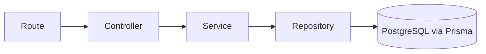
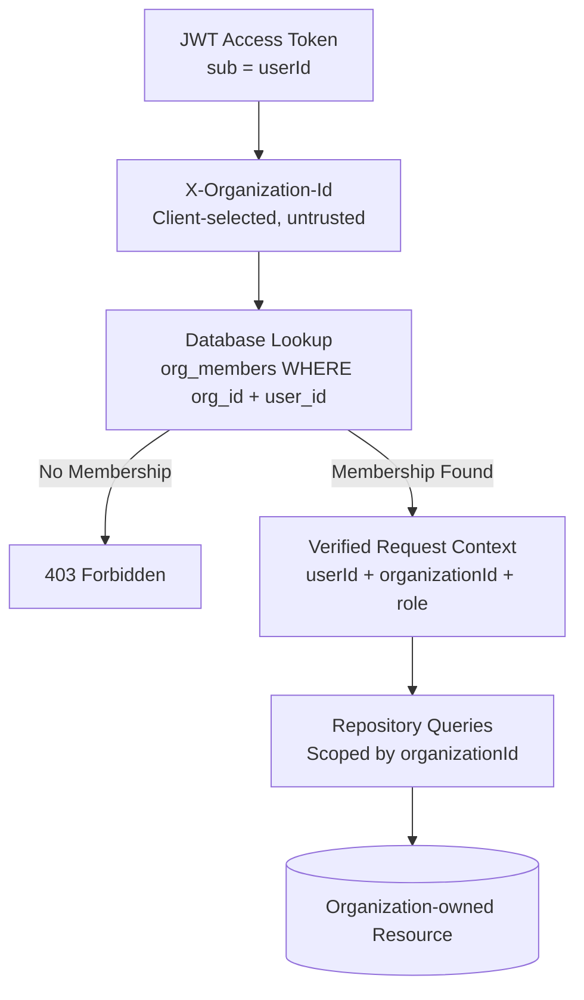
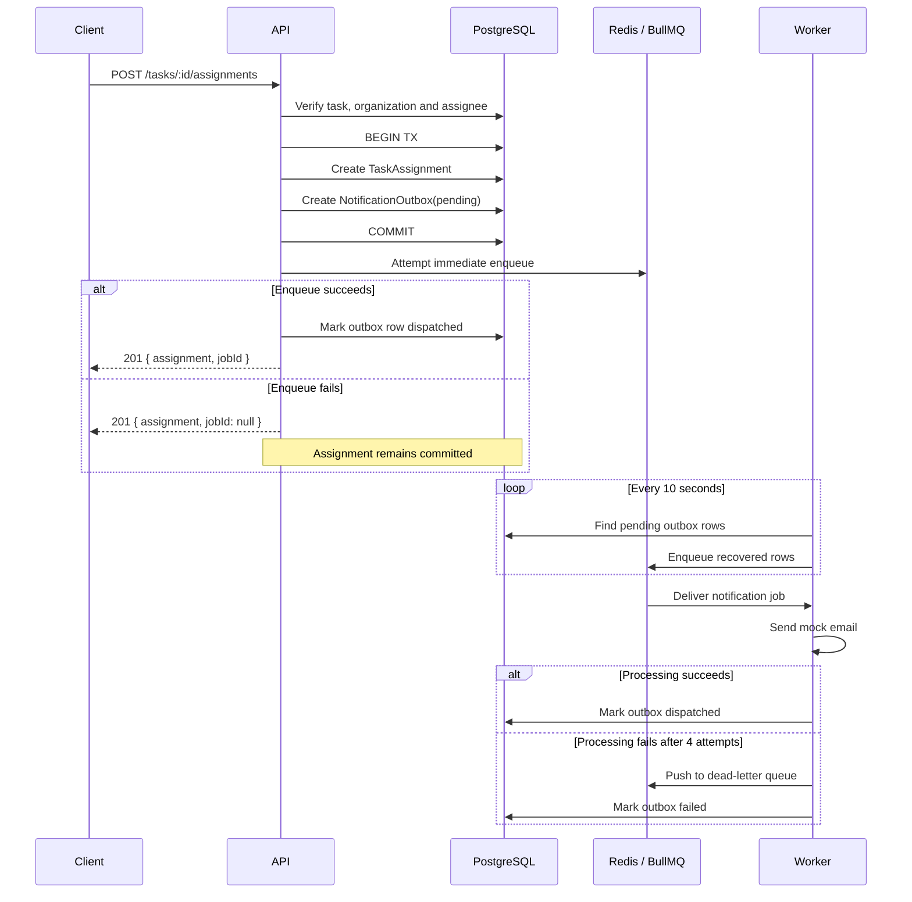
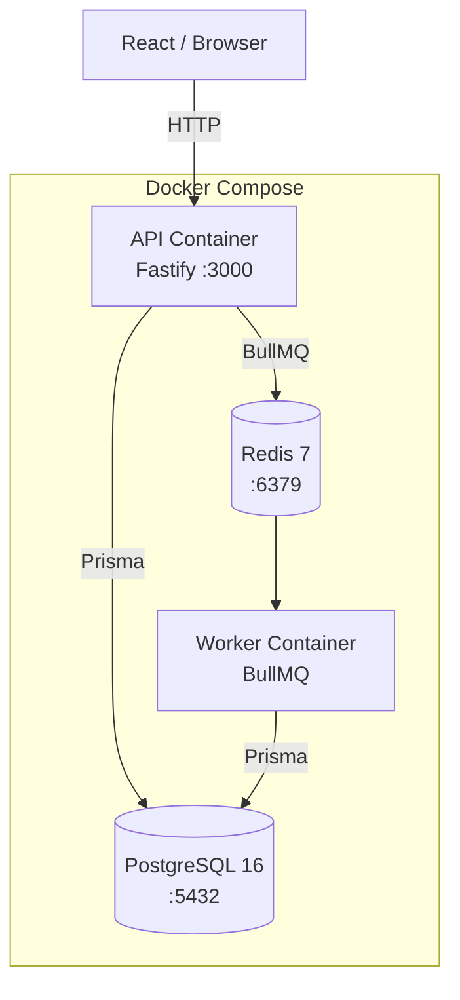

## Architecture

### System Architecture


The API and worker are separate Node.js processes and separate Docker services built from the same codebase using multi-stage Docker targets.

The API never runs the worker in-process. Task assignment enqueues a background job and returns without waiting for notification processing. The worker consumes jobs independently.

This separation allows the API and worker to be restarted, scaled, or operated independently.

---

### Request → Response Layering

Every API route follows the same application layering:



* **Routes** — Define URLs and attach authentication, tenant-context, and RBAC hooks.
* **Controllers** — Parse and validate requests using Zod and map service results to HTTP responses. Business rules do not live here.
* **Services** — Own business rules such as duplicate assignment detection, project deletion authorization, and dashboard calculations.
* **Repositories** — The only application layer that directly accesses Prisma.

---

### Authentication Flow


```
sequenceDiagram
    participant C as Client
    participant A as API
    participant DB as PostgreSQL

    C->>A: POST /auth/register or /auth/login
    A->>DB: Verify/create user (bcrypt, cost 12)
    A->>DB: Store refresh token (SHA-256 hash, 7d TTL)
    A-->>C: Access token (JWT, 15m) + refresh token

    C->>A: Request with Authorization: Bearer <access token>
    A->>A: Verify JWT signature + expiry

    C->>A: X-Organization-Id header
    A->>DB: Lookup org_members(user, organization) → role
    A-->>C: 403 if no membership; otherwise proceed
```


The access token contains the user identity required for authentication. Organization membership and role are resolved server-side from PostgreSQL.

---

### Multi-Tenant Authorization Flow



The `X-Organization-Id` header is only a selector indicating which organization the user wants to operate against.

It is **not** treated as an authorization decision.

Authorization is established through the database membership lookup. A user who is not a member of the selected organization receives `403 Forbidden`, regardless of the organization ID supplied by the client.

---

### Task Assignment → Notification Flow



See [`docs/technical-decisions.md`](technical-decisions.md) for the detailed rationale behind the consistency strategy and the guarantees provided by PostgreSQL and Redis.

---

## Background Job Architecture

### Queue

```text
task-assignment-notifications
```

BullMQ queue backed by Redis.

### Producer

The task assignment service creates the notification job after the database transaction commits.

### Consumer

The dedicated worker process consumes the queue and executes:

```text
processAssignmentNotification
```

### Retry Policy

```text
Initial attempt
      ↓
Retry #1 — 1s
      ↓
Retry #2 — 2s
      ↓
Retry #3 — 4s
      ↓
Dead-Letter Queue
```

There are **4 total attempts**:

```text
1 initial + 3 retries
```

### Dead-Letter Queue

```text
task-assignment-notifications-dlq
```

After all attempts are exhausted, the failed notification is moved to the dedicated dead-letter queue.

### Outbox Recovery

The worker performs a recovery sweep every **10 seconds**.

It searches for `NotificationOutbox` records that remain `pending` after a **5-second grace period** and republishes them to BullMQ.

This covers the failure case where the database transaction succeeds but the API's immediate queue enqueue attempt fails.

### Global Queue Rate Limit

The worker uses BullMQ's global limiter:

```text
max: 50
duration: 60000
```

The limit is coordinated through Redis, so multiple worker instances share the throughput limit rather than each instance independently processing 50 jobs per minute.

---

## Deployment Architecture



The API and worker use separate Docker services while sharing the same PostgreSQL and Redis infrastructure.

PostgreSQL and Redis are internal infrastructure services and are not required to be exposed to the browser.

---

## Design Summary

```text
                         ┌──────────────────┐
                         │  React / Client   │
                         └────────┬─────────┘
                                  │
                                  ▼
                         ┌──────────────────┐
                         │   Fastify API    │
                         │                  │
                         │ Auth / RBAC      │
                         │ Multi-tenancy    │
                         │ Business Logic   │
                         └───────┬───┬──────┘
                                 │   │
                       Prisma    │   │ BullMQ
                                 │   │
                                 ▼   ▼
                        ┌─────────┐ ┌─────────┐
                        │Postgres │ │  Redis  │
                        └─────────┘ └────┬────┘
                                         │
                                         ▼
                                  ┌─────────────┐
                                  │    Worker   │
                                  │             │
                                  │ Notifications│
                                  │ Retry / DLQ │
                                  └──────┬──────┘
                                         │
                                         ▼
                                  ┌─────────────┐
                                  │ Mock Email  │
                                  └─────────────┘
```

### Core architectural properties

* **API and worker are independently deployable processes.**
* **PostgreSQL is the source of truth for application state.**
* **Redis/BullMQ handles asynchronous notification processing.**
* **Authorization is resolved server-side from organization membership.**
* **Repository queries are organization-scoped.**
* **Task assignment and outbox creation are committed transactionally.**
* **Failed queue submission can be recovered by the worker.**
* **Notification processing supports retries and a dead-letter queue.**
* **The HTTP request does not wait for background notification processing.**
