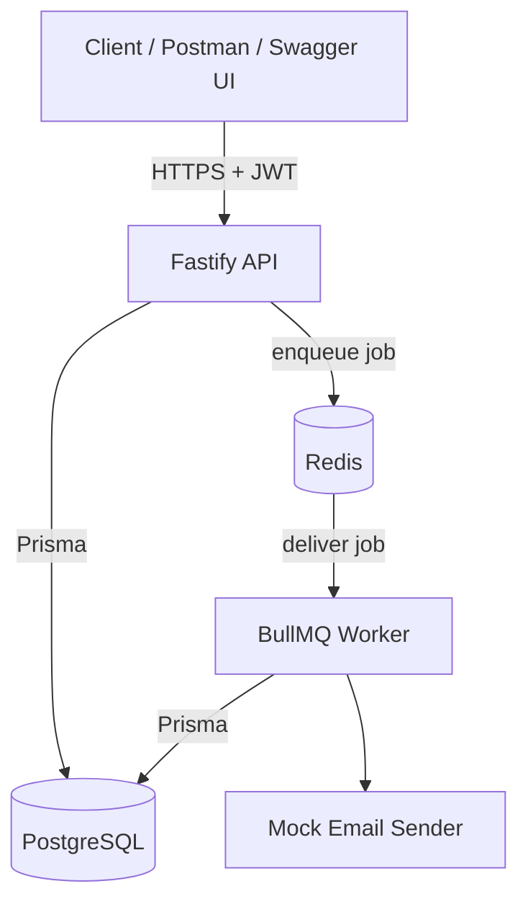
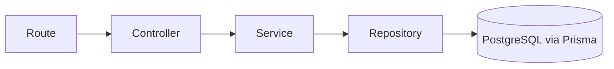
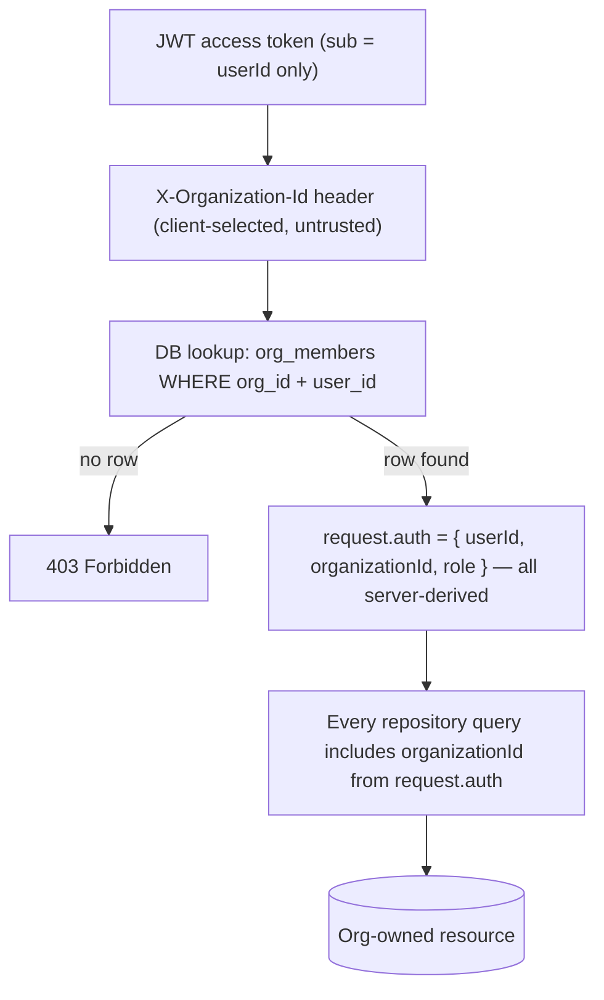

# TaskFlow — Architecture

## System architecture



The API and worker are two separate Node.js processes (two separate Docker
images built from the same codebase via multi-stage build targets). The API
never runs the worker in-process — the assignment endpoint enqueues a job and
returns immediately; the worker consumes it independently. This means the API
can be scaled, restarted, or briefly unavailable without the worker's
processing loop being affected, and vice versa.

## Request → response layering

Every route follows the same layering, so business logic is never scattered
across controllers:



- **Routes** wire URLs to controllers and attach `preHandler` hooks (auth, tenant context, RBAC).
- **Controllers** parse/validate the request (Zod) and map the service result to an HTTP response. No business rules live here.
- **Services** own business rules: what counts as a duplicate assignment, who can delete a project, how a dashboard is computed.
- **Repositories** are the only files that call Prisma directly.

## Authentication flow

```mermaid
sequenceDiagram
    participant C as Client
    participant A as API
    participant DB as PostgreSQL

    C->>A: POST /auth/register or /auth/login
    A->>DB: verify/create user (bcrypt hash, cost 12)
    A->>DB: store refresh token (SHA-256 hash, 7d TTL)
    A-->>C: access token (JWT, 15m) + refresh token

    C->>A: Any request with Authorization: Bearer <access token>
    A->>A: verify JWT signature + expiry
    C->>A: X-Organization-Id header selects org context
    A->>DB: look up org_members(org, user) -> role
    A-->>C: 403 if no membership row exists; otherwise proceed
```

## Multi-tenant authorization flow



The organization id in the header is only a *selector* telling the API which
of the user's organizations they want to act as. Authorization never comes
from that header value directly — it comes from the database lookup that
follows it. A user who is not actually a member of the selected org gets 403
regardless of what the header says.

## Assignment → notification flow

```mermaid
sequenceDiagram
    participant C as Client
    participant A as API
    participant DB as PostgreSQL
    participant Q as Redis / BullMQ
    participant W as Worker

    C->>A: POST /tasks/:id/assignments
    A->>DB: verify task in org, assignee in org, no duplicate
    A->>DB: BEGIN TX: create TaskAssignment + NotificationOutbox(pending) ; COMMIT
    A->>Q: attempt immediate enqueue (best effort)
    alt enqueue succeeds
        A->>DB: mark outbox row dispatched
        A-->>C: 201 { assignment, jobId }
    else enqueue fails
        A-->>C: 201 { assignment, jobId: null }
        Note over A,DB: assignment is still committed — nothing rolls back
    end

    loop every 10s
        W->>DB: find outbox rows still pending after grace period
        W->>Q: enqueue any recovered rows
    end

    Q->>W: deliver job
    W->>W: send mock email
    alt success
        W->>DB: mark outbox dispatched
    else fails after 4 attempts (1 initial + 3 retries, 1s/2s/4s backoff)
        W->>Q: push to dead-letter queue
        W->>DB: mark outbox failed
    end
```

See `docs/technical-decisions.md` for the full rationale behind this
consistency strategy, including what Postgres+Redis do *not* guarantee.

## Background job architecture

- **Queue**: `task-assignment-notifications` (BullMQ, backed by Redis).
- **Producer**: the assignment service, immediately after committing the DB transaction.
- **Consumer**: the worker process, running `processAssignmentNotification`.
- **Retry policy**: 4 total attempts (1 initial + 3 retries), exponential backoff 1s → 2s → 4s.
- **Dead-letter queue**: `task-assignment-notifications-dlq`, a separate BullMQ queue populated when a job's `failed` event fires after attempts are exhausted.
- **Recovery**: a 10-second interval sweep in the worker publishes any `NotificationOutbox` row still `pending` after a 5-second grace period, covering the case where the API's immediate enqueue attempt failed.
- **Global rate limit (bonus)**: the worker is configured with BullMQ's `limiter: { max: 50, duration: 60000 }`, which is coordinated through Redis — so running multiple worker instances still caps total throughput at 50/min rather than 50/min *per worker*.
