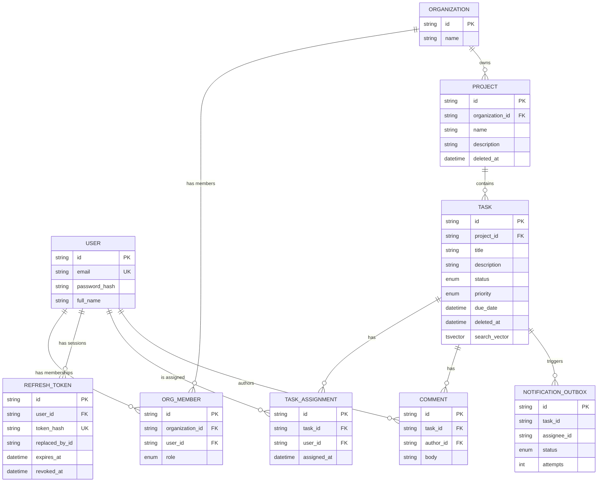

# TaskFlow — Database Design

## Entity relationship diagram

## Table responsibilities

| Table | Responsibility |
|---|---|
| `users` | Global identity. Not org-scoped — a user can belong to multiple orgs. |
| `refresh_tokens` | One row per issued refresh token (hashed), enabling per-session revocation and logout-all-devices. |
| `organizations` | The tenant boundary. Every org-owned resource traces back here. |
| `org_members` | Explicit join between user and organization, carrying the role for *that* org (a user's role can differ across orgs). |
| `projects` | Org-owned container for tasks. |
| `tasks` | Project-owned unit of work; carries status/priority/due date and the generated `search_vector` column for full-text search. |
| `task_assignments` | Many-to-many between tasks and users, modeled explicitly (not an implicit join table) so it can be referenced by the notification outbox and carry `assigned_at`. |
| `comments` | Task-scoped, author-attributed notes. |
| `notification_outbox` | Transactional outbox for the assignment → notification flow (see technical-decisions.md). Not a "real" domain table — it's an implementation detail of reliable async delivery. |

## Important constraints

- `users.email` — unique.
- `refresh_tokens.token_hash` — unique (the hash, not the raw token, is ever stored).
- `org_members(organization_id, user_id)` — unique. A user has at most one role per organization.
- `task_assignments(task_id, user_id)` — unique. Enforced at the DB level in addition to the service-layer pre-check, so a race condition (two concurrent assignment requests) can't create a duplicate row even if the application-level check is bypassed by a bug or a direct DB write.

## Foreign keys and deletion behavior

| Relationship | On delete | Rationale |
|---|---|---|
| `refresh_tokens.user_id → users.id` | CASCADE | A session cannot outlive its user. |
| `org_members.organization_id → organizations.id` | CASCADE | Membership is meaningless without the org. |
| `org_members.user_id → users.id` | CASCADE | Membership is meaningless without the user. |
| `projects.organization_id → organizations.id` | CASCADE | An org-less project is meaningless; org deletion is a rare admin action. |
| `tasks.project_id → projects.id` | CASCADE | A task cannot exist outside its project. |
| `task_assignments.task_id → tasks.id` | CASCADE | An assignment cannot outlive its task. |
| `task_assignments.user_id → users.id` | **RESTRICT** | Preserves assignment history — a user isn't meant to be hard-deleted while they still have assignment records; deactivate instead. |
| `comments.task_id → tasks.id` | CASCADE | A comment cannot outlive its task. |
| `comments.author_id → users.id` | **RESTRICT** | Preserves the comment's authorship/audit trail. |

## Enums

- `OrgRole`: `org_admin`, `member`
- `TaskStatus`: `todo`, `in_progress`, `review`, `done`
- `TaskPriority`: `low`, `medium`, `high`, `urgent`
- `OutboxStatus`: `pending`, `dispatched`, `failed` (internal to the notification outbox, not exposed on the public API)

## Soft delete behavior (projects, tasks)

`deleted_at` is set (never a hard `DELETE`) when a project or task is
"deleted". Consistent behavior across all operations:
- **GET by id**: returns 404 if `deleted_at IS NOT NULL` (as if the row doesn't exist).
- **LIST**: `deleted_at IS NULL` is always part of the `WHERE` clause — soft-deleted rows never appear.
- **UPDATE**: soft-deleted rows cannot be updated (the `WHERE` clause used by `updateMany` includes `deleted_at IS NULL`, so the update silently matches zero rows and the service layer raises `*_NOT_FOUND`).
- **DELETE (again)**: idempotently a no-op that also raises `*_NOT_FOUND` (nothing eligible was found to delete), rather than a special "already deleted" state.
- **Task dashboard counts**: only counts non-deleted tasks (`deleted_at IS NULL` in the `groupBy` where clause).
- Deleting a project does **not** cascade a soft-delete onto its tasks in this implementation — a known, documented limitation (see README "Known limitations"). A production version would need to either cascade the soft-delete or filter tasks by `project.deleted_at IS NULL` everywhere (the latter is already done for task listing/lookup).
