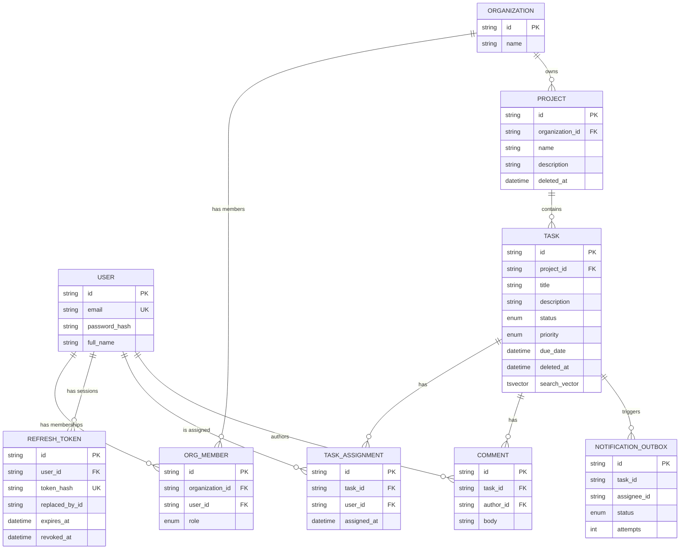

# TaskFlow — Database Design

## Entity Relationship Diagram



---

## Table Responsibilities

| Table                 | Responsibility                                                                                                                                                 |
| --------------------- | -------------------------------------------------------------------------------------------------------------------------------------------------------------- |
| `users`               | Global user identity. Users are not organization-scoped and may belong to multiple organizations.                                                              |
| `refresh_tokens`      | Stores one hashed refresh-token record per session, enabling per-session revocation and logout from all devices.                                               |
| `organizations`       | Defines the tenant boundary. Organization-owned resources ultimately belong to an organization.                                                                |
| `org_members`         | Explicit user-to-organization relationship containing the user's role within that organization.                                                                |
| `projects`            | Organization-owned containers for tasks.                                                                                                                       |
| `tasks`               | Project-owned units of work containing status, priority, due date, and the generated full-text search vector.                                                  |
| `task_assignments`    | Explicit many-to-many relationship between tasks and users. The model also stores `assigned_at` and provides a reference point for notification processing.    |
| `comments`            | Task-scoped comments attributed to their authors.                                                                                                              |
| `notification_outbox` | Transactional outbox used by the task-assignment notification workflow. This is an infrastructure/reliability table rather than a user-facing domain resource. |

---

## Important Constraints

### User Email

```text
users.email
```

is unique.

### Refresh Token Hash

```text
refresh_tokens.token_hash
```

is unique.

Only the hash of a refresh token is persisted; the raw refresh token is never stored.

### Organization Membership

```text
org_members(organization_id, user_id)
```

is unique.

This guarantees that a user can have at most one membership and therefore one role within a particular organization.

### Task Assignment

```text
task_assignments(task_id, user_id)
```

is unique.

The uniqueness constraint is enforced at the database level in addition to the service-layer duplicate check. This protects against concurrent requests creating duplicate assignments.

---

## Foreign Keys and Deletion Behavior

| Relationship                                     | On Delete  | Rationale                                                                                                    |
| ------------------------------------------------ | ---------- | ------------------------------------------------------------------------------------------------------------ |
| `refresh_tokens.user_id → users.id`              | `CASCADE`  | A refresh-token session cannot outlive its user.                                                             |
| `org_members.organization_id → organizations.id` | `CASCADE`  | Membership has no meaning without its organization.                                                          |
| `org_members.user_id → users.id`                 | `CASCADE`  | Membership has no meaning without its user.                                                                  |
| `projects.organization_id → organizations.id`    | `CASCADE`  | Projects cannot exist outside their organization.                                                            |
| `tasks.project_id → projects.id`                 | `CASCADE`  | Tasks cannot exist outside their project.                                                                    |
| `task_assignments.task_id → tasks.id`            | `CASCADE`  | An assignment cannot outlive its task.                                                                       |
| `task_assignments.user_id → users.id`            | `RESTRICT` | Preserves assignment history. Users should be deactivated rather than hard-deleted while assignments remain. |
| `comments.task_id → tasks.id`                    | `CASCADE`  | A comment cannot exist without its task.                                                                     |
| `comments.author_id → users.id`                  | `RESTRICT` | Preserves comment authorship and audit history.                                                              |

---

## Enums

### `OrgRole`

```text
org_admin
member
```

### `TaskStatus`

```text
todo
in_progress
review
done
```

### `TaskPriority`

```text
low
medium
high
urgent
```

### `OutboxStatus`

```text
pending
dispatched
failed
```

`OutboxStatus` is an internal notification-processing state and is not exposed as a public API resource.

---

# Soft Delete Strategy

Projects and tasks use **soft deletion**.

Instead of physically deleting the record, the application sets:

```text
deleted_at
```

to the deletion timestamp.

This preserves the underlying record while removing it from normal application visibility.

## GET by ID

A deleted project or task behaves as if it does not exist.

```text
deleted_at IS NULL
```

is required.

The API returns:

```text
404 Not Found
```

for soft-deleted resources.

---

## LIST

List queries always exclude soft-deleted resources:

```sql
WHERE deleted_at IS NULL
```

Therefore deleted projects and tasks do not appear in normal collection responses.

---

## UPDATE

Soft-deleted resources cannot be updated.

The update operation includes:

```sql
deleted_at IS NULL
```

in its eligibility condition.

If no eligible record is updated, the service layer returns the corresponding not-found error.

---

## DELETE

Deletion is intentionally idempotent from the application's perspective.

Once a resource has already been soft-deleted, another delete request does not expose a separate "already deleted" state.

Instead, no eligible resource is found and the service returns:

```text
*_NOT_FOUND
```

---

## Dashboard Counts

Dashboard statistics only include active tasks:

```sql
deleted_at IS NULL
```

This prevents soft-deleted tasks from affecting project statistics.

---

## Project → Task Soft Delete Behavior

Deleting a project does **not** automatically set `deleted_at` on its tasks.

This is a documented limitation of the current implementation.

Task queries are already designed to exclude tasks belonging to deleted projects where applicable.

A production implementation could instead explicitly cascade the soft-delete operation from project → tasks, or consistently derive task visibility from both:

```text
task.deleted_at IS NULL
AND
project.deleted_at IS NULL
```

The current behavior is intentionally documented rather than hidden.

---

# Data Integrity Summary

The database provides several layers of integrity protection:

```text
Application validation
        ↓
Service-level business rules
        ↓
Repository constraints
        ↓
Database foreign keys
        ↓
Unique constraints
        ↓
Transactional writes
```

This means important invariants such as unique organization membership and unique task assignment do not depend solely on application-level checks.

The database remains the final enforcement layer for relational integrity.
